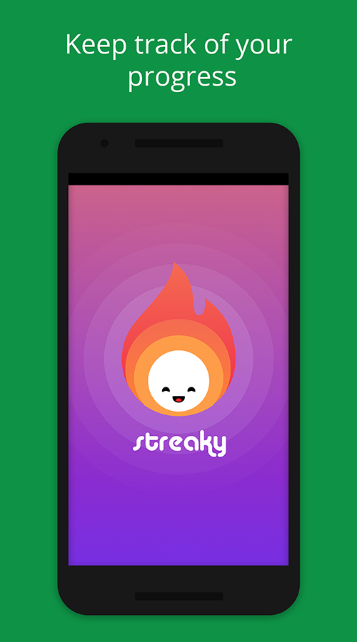
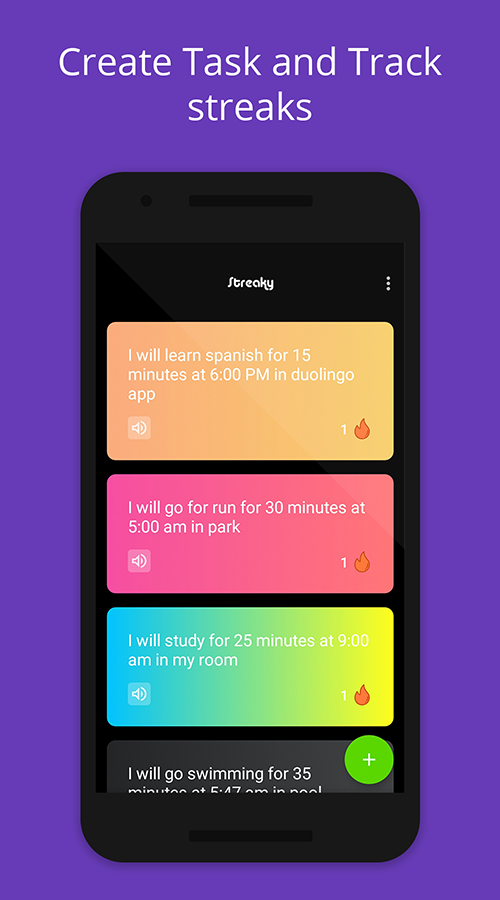
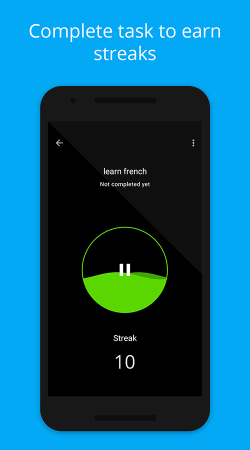
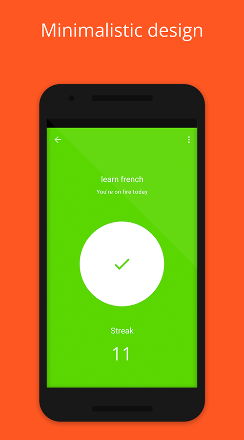
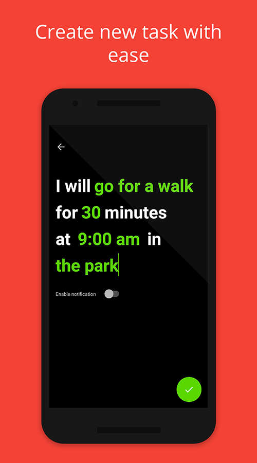

# Streaky

Streaky was born from streak counting mechanism of [Duolingo](https://play.google.com/store/apps/details?id=com.duolingo&hl=en_IN) app, which motivated me to keep learning Spanish. Gracias Duolingo. Streaky is a streak counter app, to help track your habits/task by maintaining streak, it's also ad-free and open source under GNUv3 license.

## Screenshots

  
  
  
  
  

## Getting Started

_Follow these instructions to build and run the project_

1. Clone this repository.
2. Download the appropriate [JDK](http://www.oracle.com/technetwork/java/javase/downloads/jdk8-downloads-2133151.html)
for your system. We are currently on JDK 8.
3. [Install Android Studio](https://developer.android.com/sdk/index.html).
4. Import the project. Open Android Studio, click `Open an existing Android
   Studio project` and select the project. Gradle will build the project.
5. Run the app. Click `Run > Run 'app'`. After the project builds you'll be
   prompted to build or launch an emulator.

### Prerequisites

Basic knowledge of Android App development along with [Android Jetpack](https://developer.android.com/jetpack/). App uses MVVM along with data binding, the code is written as clean as possible if you have better implementation, create a pull request. Help grow this project. You can find `TODO` and `FIXME` comment in code for your starting point. We follow [Git flow](https://www.youtube.com/watch?v=aJnFGMclhU8) for branch management.

## Contributing

###### Code 
If you are a developer and you wish to contribute to the app please fork the project
and submit a pull request on the [develop branch](https://github.com/alexakasanjeev/streak-counter/tree/develop).

###### Issues
You can trace the status of known issues [here](https://github.com/alexakasanjeev/streak-counter/issues),
also feel free to file a new issue (helpful description, screenshots and logcat are appreciated)

###### Translations
If you are able to contribute with a new translation of a missing language or if you want to improve an existing one, we greatly appreciate any suggestion!

###### Suggestion/Ideas
If you have a feature request or idea which will enhance the user experience of app or have better UI design, you can send it via [mail](mailto:sanjeevy133@protonmail.com) or create an issue with heading SUGGESTION.

## Thanks

- [WaveView](https://github.com/gelitenight/WaveView) created by [gelitenight](https://github.com/gelitenight)
- [WaveLoadingView](https://github.com/tangqi92/WaveLoadingView) created by [tangqi92](https://github.com/tangqi92)

## Contact Me

Born in 1995, completed my graduation in Computer Engineering in 2018 along with [Udacity Android Nanodegree](https://in.udacity.com/course/android-developer-nanodegree-by-google--nd801). Loving technology, programming, reading and art.

Open for full-time job in Android or Full stack development.

If you have any questions or want to make friends with me, please feel free to contact me : [mailto](mailto:sanjeevy133@protonmail.com "Welcome to contact me")

## License

This project is licensed under the GNU v3 Public License License - see the [LICENSE.md](LICENSE.md) file for details

